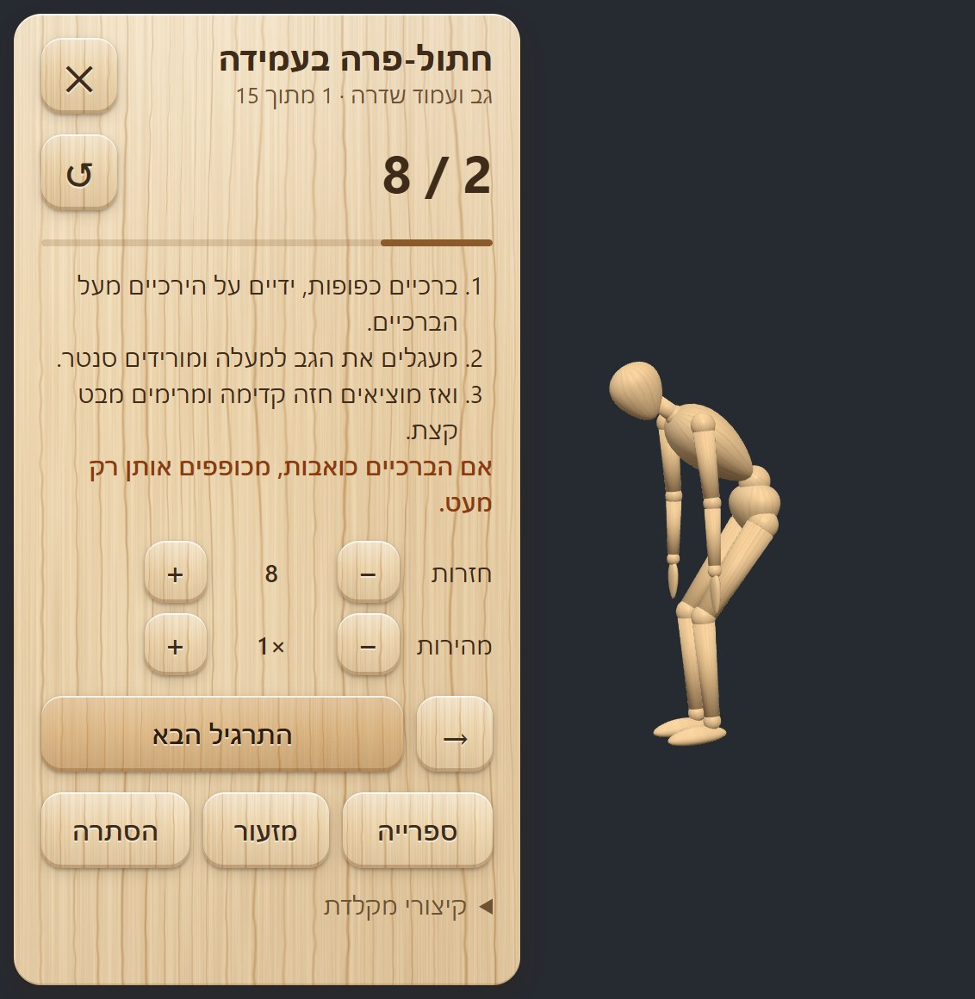

# Desk Break

[](https://github.com/shlomorsh/desk-break/releases/latest) [](https://github.com/shlomorsh/desk-break/releases/latest) [](LICENSE)

Two things in one repository:

1. **An open library of 435 rigged exercise animations** on a wooden artist's mannequin: stretches, mobility,
   yoga, chair and floor work, low-impact cardio, dances and a few silly ones. One GLB, one Blender file,
   MIT licensed. Use them in your own apps, games and videos.
   **[Browse all of them in your browser](https://parametric.co.il/desk-break/library/)** ·
   [jump to the library section](#the-animation-library)
2. **A small desktop app built on it**: the mannequin stands on your screen and shows you a short exercise
   whenever you're waiting for the computer (a build, a render, an AI agent working). Click for the next one.



## The desktop app

- **Just the figure on screen.** No window and no background. Drag it anywhere. Hover to see the exercise
  and its counter; click to open the panel with full instructions.
- **Counts for you.** Repetitions are counted from the animation itself; timed exercises get a timer
  (with "first side / second side"). A short chime when you're done.
- **Your own set.** It starts with 15 quick desk-break moves. Add or remove anything from the library,
  change reps, time or speed per exercise (dances use BPM), and choose the order: mixed body areas,
  in order, or random.
- **Gets out of the way.** Shrink it to a small wooden head, tuck it into a screen edge, or hide it fully;
  `Ctrl+Alt+M` or the tray icon brings it back. `Ctrl+Alt+N` gives the next exercise from any app.

### Download

**[DeskBreak-Setup.exe](https://github.com/shlomorsh/desk-break/releases/latest/download/DeskBreak-Setup.exe)** (Windows 10/11).
It isn't code-signed yet, so the first time Windows shows "Windows protected your PC": click *More info*, then *Run anyway*.

### Run from source

With [Node.js](https://nodejs.org) 20 or newer:

```
git clone https://github.com/shlomorsh/desk-break.git
cd desk-break
npm install
npm start
```

If your npm has `ignore-scripts` turned on, Electron's binary is not downloaded by `npm install`;
run `node node_modules/electron/install.js` once. If you start it from a VS Code terminal and it
fails with `require('electron')`, clear `ELECTRON_RUN_AS_NODE` first (`start.bat` does this for you).

## The animation library

Free exercise animation with a rig is hard to find: the big mocap sets are research-only or can't be
redistributed. This one was made from scratch for this project, so it is yours to use (MIT).

| Category | Animations |
|---|---|
| Neck, shoulders & arms | 42 |
| Back & spine | 36 |
| Hips & legs | 40 |
| Low-impact cardio (no jumping) | 30 |
| Balance | 26 |
| Seated on a chair | 55 |
| Seated on the floor | 40 |
| Lying down & on all fours | 46 |
| Yoga | 46 |
| Dance & hip hop (with BPM) | 35 |
| Funny (stage dive, drop the mouse, backflip…) | 39 |

### What to download

Everything is in [`library/`](library):

| File | What it is |
|---|---|
| [`exercises.glb`](library/exercises.glb) | Mannequin + rig + all 435 animations, for three.js, Unity, Unreal, Godot or any glTF importer (8 MB) |
| [`exercises.blend`](library/exercises.blend) | The same as a Blender file: one Action per exercise, wood texture packed inside (saved with Blender 5.2) |
| [`mannequin.blend`](library/mannequin.blend) / [`mannequin.glb`](library/mannequin.glb) | The original rig and mesh alone, no animation |
| [`exercises.json`](library/exercises.json) | For every animation: id, name (Hebrew and English), category, amount, step-by-step instructions (Hebrew), camera hint, tempo, key times |
| [`exercises/*.json`](library/exercises) | The source: each exercise is a few poses written as joint angles |

No need to clone: the same files are attached to the [latest release](https://github.com/shlomorsh/desk-break/releases/latest).

Animation names are the ids in `exercises.json` (`neck-side-tilt`, `warrior-2`, `funny-stage-dive`…).

### The rig

- 15 body bones: `hips` (root), `spine`, `neck`, and left/right `arm`, `elbow`, `hand`, `leg`, `knee`, `foot`.
  One extra bone, `prop`, carries a small computer mouse and is scaled to zero unless an animation uses it.
- 1.75 m tall, metres, feet on the floor at the origin. Rigid skinning: every part follows one bone.
- Animations are sampled at 30 fps and loop, except the ones marked `"once"` in the JSON. The root height is
  baked so the body stays on the floor; chair exercises (`"seated"`) assume a seat 0.45 m high.
- Simple on purpose: no fingers, no IK, and the back is one piece. The bones are short stubs that all point up,
  so every rest rotation is identity and a pose is plain angles. It looks unusual in Blender's viewport;
  it makes the animations easy to write and to retarget by hand.

### Use it in three.js

```js
import { GLTFLoader } from 'three/addons/loaders/GLTFLoader.js';
const gltf = await new GLTFLoader().loadAsync('exercises.glb');
scene.add(gltf.scene);
const mixer = new THREE.AnimationMixer(gltf.scene);
mixer.clipAction(THREE.AnimationClip.findByName(gltf.animations, 'warrior-2')).play();
// each frame: mixer.update(deltaSeconds)
```

[`library/gallery.html`](library/gallery.html) is a complete example that plays all of them on one page.

### Add or change exercises

Read [`library/AUTHORING.md`](library/AUTHORING.md), edit a category file, and rebuild with Blender
(built and tested with 5.2):

```
blender -b -P library/build_library.py
bash library/check.sh <category>     # build one category and photograph every pose
```

The mannequin (`build_mannequin.py`) and its maple texture (`make_wood.py`) are generated by script too.
`npm run dist` builds the Windows installer into `dist/`.

## Code signing policy

Windows builds are made by [GitHub Actions](.github/workflows/build.yml) straight from this repository.
The installer is not code-signed yet, so Windows shows "Windows protected your PC" on first run
(More info, then Run anyway). Signing through [SignPath Foundation](https://signpath.org) is planned
once the project is more established; the build workflow is already prepared for it.

- Committers and reviewers: [Shlomi Reshef](https://github.com/shlomorsh)
- Approvers: [Shlomi Reshef](https://github.com/shlomorsh)

### Privacy

This program will not transfer any information to other networked systems unless specifically requested
by the user or the person installing or operating it. Everything it remembers (your exercise set, sizes,
position on screen) stays on your computer.

## A note on health

These are gentle general movements, not medical advice. If something hurts, stop and skip to the next one.
If you have joint or back problems, check with a doctor or physiotherapist which moves suit you.

## License

[MIT](LICENSE) for the code, the mannequin and the exercise library. Made by
[Shlomi Reshef](https://parametric.co.il).

---

## בעברית

דמות עץ קטנה שיושבת על שולחן העבודה של המחשב ומראה לך תרגיל קצר בכל פעם שאתה מחכה למחשב: לרינדור, לבנייה, לסוכן AI שעובד.
לחיצה, והיא עוברת לתרגיל הבא. במאגר יש גם ספרייה פתוחה של 435 אנימציות תרגילים עם ריג, ב-11 קטגוריות, כקובץ GLB וכקובץ בלנדר. מותר להשתמש בה בכל פרויקט.
