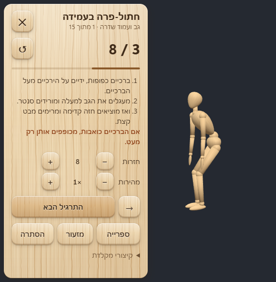
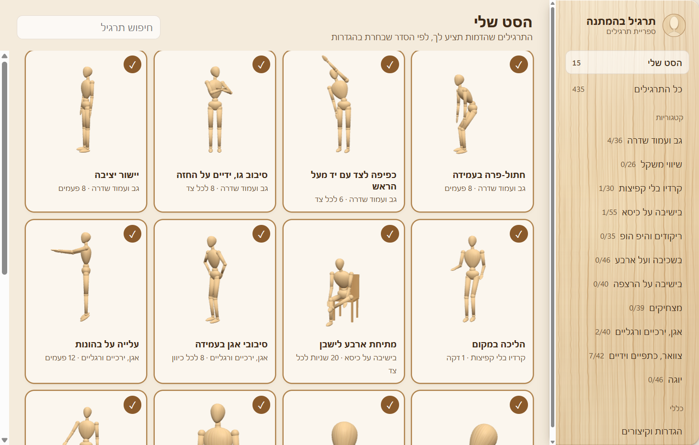

# Desk Break

A small wooden mannequin that lives on your desktop and shows you a short exercise whenever you're
waiting for the computer: a build, a render, an AI agent working. Click for the next one.

It comes with an open library of **435 animated exercises** in 11 categories, made for this project
and free to use in your own apps, games and videos.



## What it does

- **Just the figure on screen.** No window and no background. Drag it anywhere. Hover to see the exercise
  and its counter; click to open the panel with full instructions.
- **Counts for you.** Repetitions are counted from the animation itself; timed exercises get a timer
  (with "first side / second side"). A short chime when you're done.
- **Your own set.** It starts with 15 quick desk-break moves. Add or remove anything from the library,
  change reps, time or speed per exercise (dances use BPM), and choose the order: mixed body areas,
  in order, or random.
- **Gets out of the way.** Shrink it to a small wooden head, tuck it into a screen edge, or hide it fully;
  `Ctrl+Alt+M` or the tray icon brings it back. `Ctrl+Alt+N` gives the next exercise from any app.



## Run it

Windows, with [Node.js](https://nodejs.org) 20 or newer:

```
git clone https://github.com/shlomorsh/desk-break.git
cd desk-break
npm install
npm start
```

If your npm has `ignore-scripts` turned on, Electron's binary is not downloaded by `npm install`;
run `node node_modules/electron/install.js` once. If you start it from a VS Code terminal and it
fails with `require('electron')`, clear `ELECTRON_RUN_AS_NODE` first (`start.bat` does this for you).

## The exercise library

| Category | Exercises |
|---|---|
| Neck, shoulders & arms | 42 |
| Back & spine | 36 |
| Hips & legs | 40 |
| Low-impact cardio (no jumping) | 30 |
| Balance | 26 |
| Seated on a chair | 55 |
| Seated on the floor | 40 |
| Lying down & on all fours | 46 |
| Yoga | 46 |
| Dance & hip hop (with BPM) | 35 |
| Funny (stage dive, drop the mouse, backflip…) | 39 |

Everything is in [`library/`](library):

- `exercises.glb`: the mannequin with its rig and one animation per exercise, for any engine
  (three.js, Unity, Unreal, Blender, Godot).
- `exercises.json`: names (Hebrew and English), amounts, step-by-step instructions, camera hints, tempo.
- `exercises/*.json`: the source. Each exercise is a few poses written as joint angles.
- `gallery.html`: browse every animation in a browser.

To add or change exercises, read [`library/AUTHORING.md`](library/AUTHORING.md), edit a category file and
rebuild with Blender 4.2 or newer:

```
blender -b -P library/build_library.py
bash library/check.sh <category>     # build one category and photograph every pose
```

The mannequin (`build_mannequin.py`) and its maple texture (`make_wood.py`) are generated by script too.

## A note on health

These are gentle general movements, not medical advice. If something hurts, stop and skip to the next one.
If you have joint or back problems, check with a doctor or physiotherapist which moves suit you.

## License

[MIT](LICENSE) for the code, the mannequin and the exercise library. Made by
[Shlomi Reshef](https://parametric.co.il).

---

## בעברית

דמות עץ קטנה שיושבת על שולחן העבודה של המחשב ומראה לך תרגיל קצר בכל פעם שאתה מחכה למחשב: לרינדור, לבנייה, לסוכן AI שעובד.
לחיצה, והיא עוברת לתרגיל הבא. יש בה ספרייה פתוחה של 435 תרגילים מונפשים ב-11 קטגוריות, ומותר להשתמש בה בכל פרויקט.
